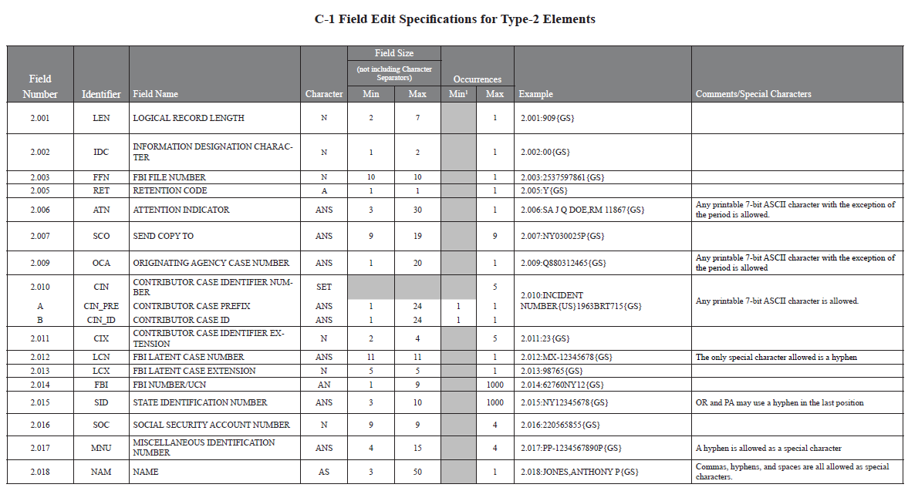
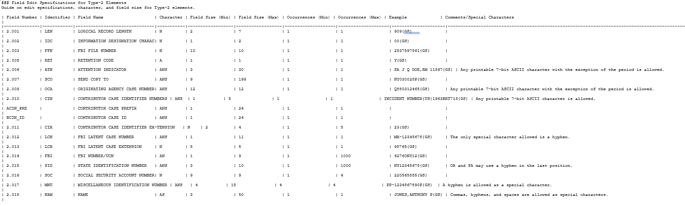
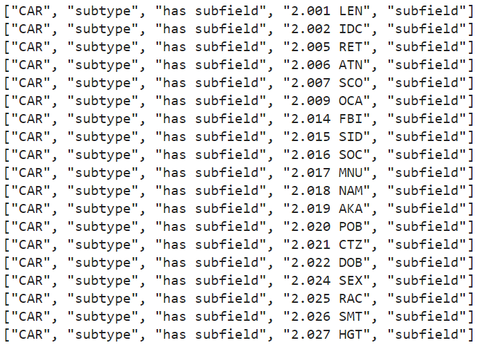
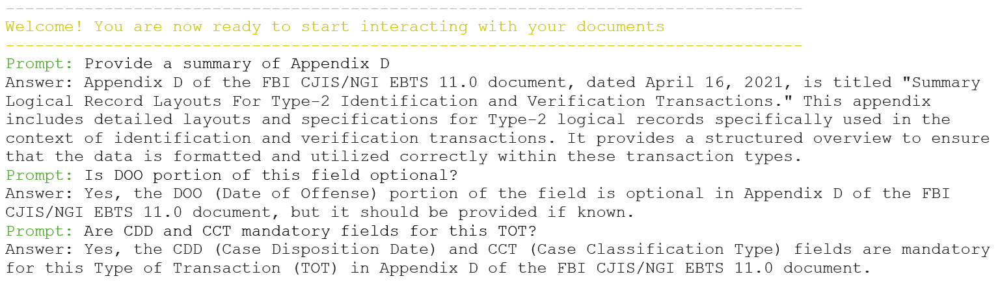
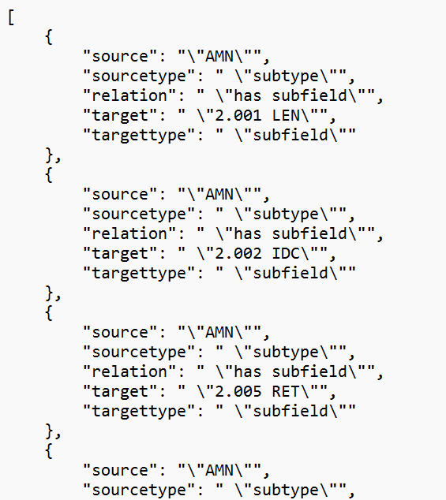
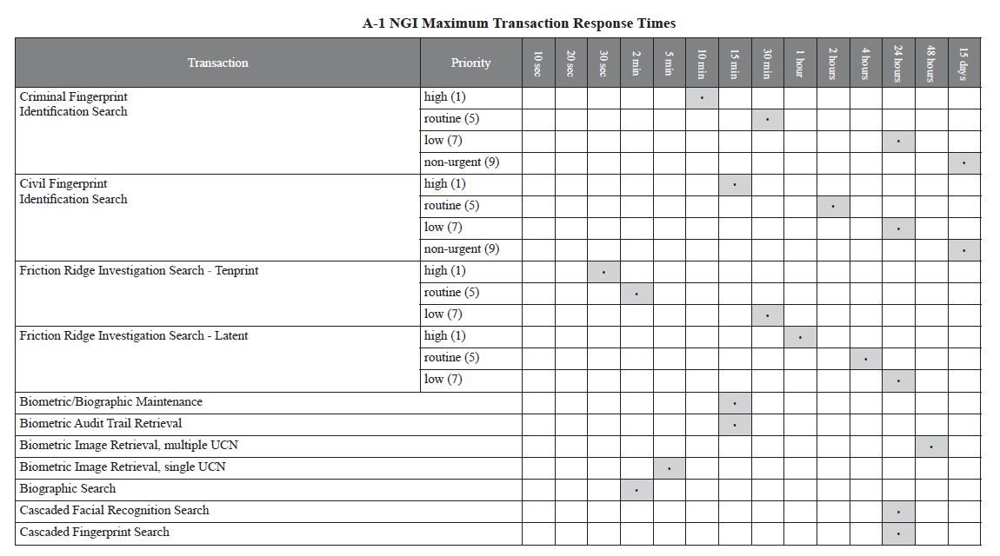
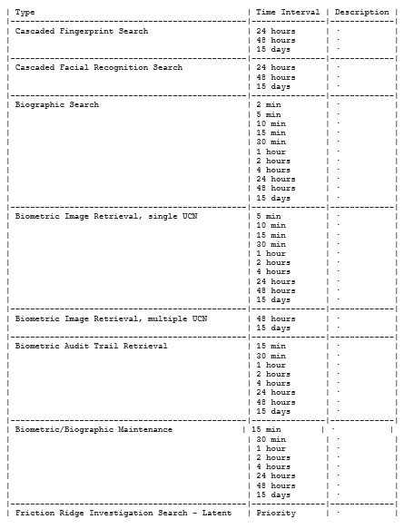

# Interview Take Home Assignment - RAG

## IDEMIA

### Objective
Create a Python pipeline that demonstrates document processing capabilities, focusing on ingesting PDF documents containing tables and integrating them with a Large Language Model (LLM) for query-based information retrieval.

### RAG Pipeline

#### 1. Document Processing
- **PDF Document Ingestion**: Implement the ingestion of PDF documents, with a special focus on extracting tables.
- **Table Parsing**: Use the LLM to parse tables within the documents and extract structured data.
- **Superscript Relations**: Relate superscripts in table columns to their references.

**File**: `llm_parse_table.py`  
**Description**: Parses complex tables within PDF documents.

**Output Example**: 
Parsing complex table with llm. On the left is the input table while on the right is the llm output. Note the output is not perfect yet, but it's a significant improvement compare to traditional methods:

Complex table:
<figure>
  
</figure>

Extracting complext table using llm
<figure>
  
</figure>

Extracting information from tables in pdf ("./document/Type_II_table.pdf") for generating knowledge graph
<figure>
  
</figure>

#### 2. LLM Inference
- **User Prompt Handling**: handle user prompts.
- **RAG Model Integration**: Integrate with a Retrieval-Augmented Generation (RAG) model to generate responses based on user queries.
- **Information Retrieval**: Retrieve relevant information from the ingested documents to include in the responses.

**File**: `llm_multi_doc.py`  
**Description**: Conducts real-time Q&A across multiple documents using RAG and LLM. Can be used to extract information and identify connections between different documents. It can also serves as a tool for onboarding to swiftly familiarize new employees with the company or for quick internal search of comapny documents.

**Output Example**: 
Conducts real-time Q&A across multiple documents using RAG and LLM
<figure>
  
</figure>

#### 3. Knowledge Graph Generation
- **Knowledge Graph**: Generate a knowledge graph from the retrieved document evidence.

**File**: `llm_main.py`  
**Description**: Contains the entire process and generates the json file for Knowledge Graph visualization at the end.

**Output Example**: 
json file for knowledge graph visualization
<figure>
  
</figure>

### Usage
1. **Knowledge Graph Visualization**:
    - Run `llm_main.py` to parse tables from the PDF documents and generate knowledge graph.
      
    ```bash
    python llm_main.py
    ```
2. **LLM Inference**:
    - Run `llm_multi_doc.py` to perform real-time Q&A and retrieve information.
      
    ```bash
    python llm_multi_doc.py
    ```
3. **Knowledge Graph Visualization**:
    - Run the following command to visualize the generated knowledge graph inside folder kg-demo.
      
    ```bash
    npm start
    ```

### Generated Knowledge Graph
[knowledge graph visualization](./image/knowledge_graph.pdf)

### Note
Previous method is not sufficient when handling complex table (previous vs llm). Have also tried out Github repos like nlmatics/nlm-ingestor,
nlmatics/llmsherpa, or Joshua-Yu/graph-rag for PDF parsing and table extraction as suggested.

Complext table
<figure>
  
</figure>

Extracting complex table using previous method
<figure>
  
</figure>
